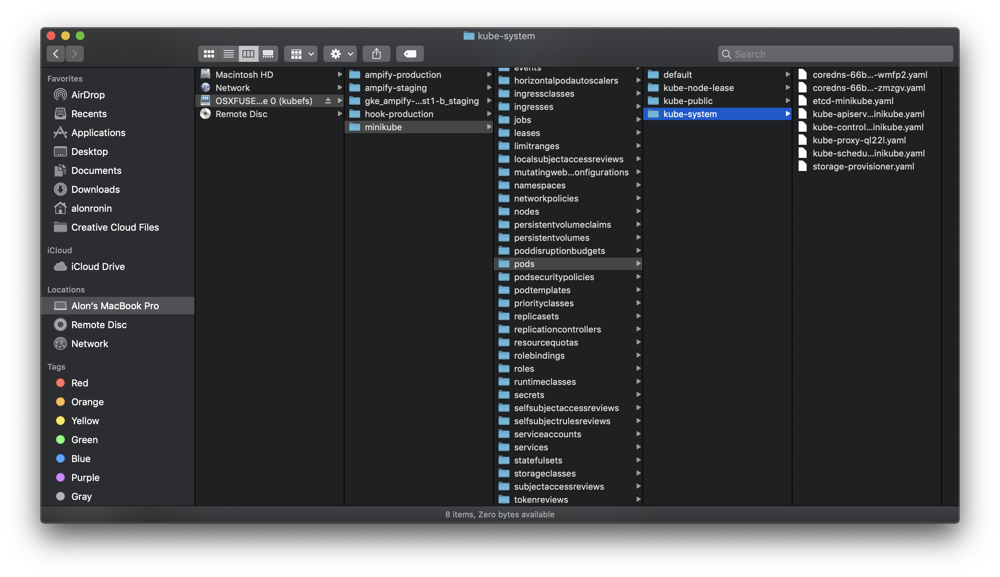
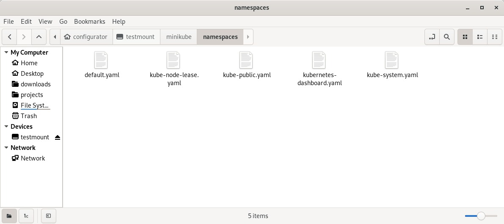
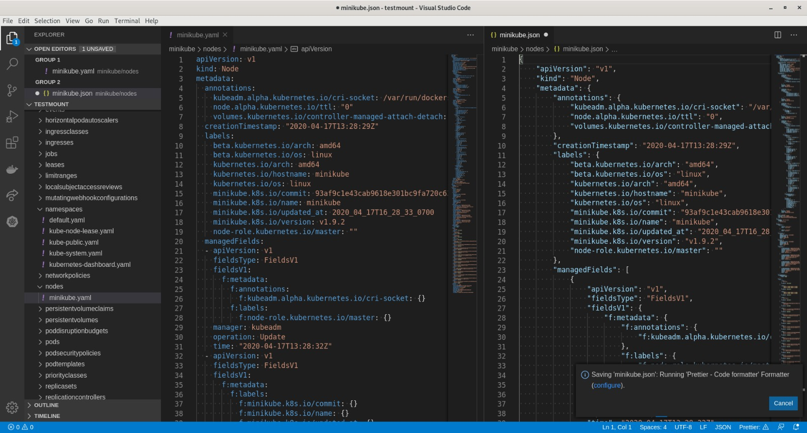
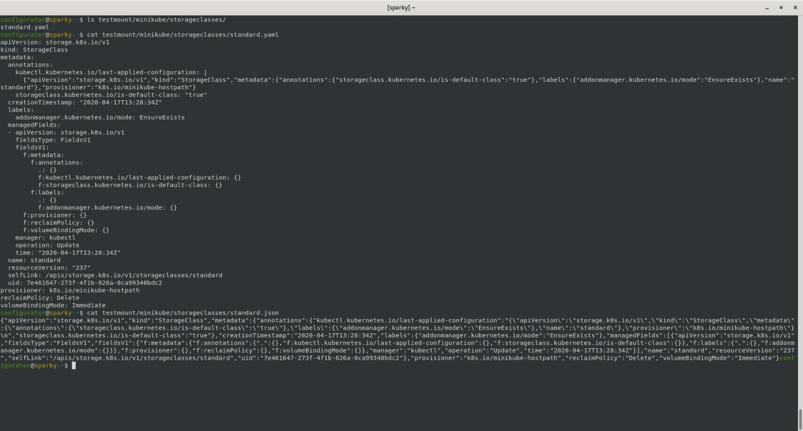

# kubefs

Mount kubernetes's metadata object store as a file system



# Downloading

There are several options for downloading kubefs:

- Download the [latest release from GitHub](https://github.com/configurator/kubefs/releases/latest)

- Build it directly from source using `go get`:

  ```shell
  go get github.com/configurator/kubefs
  ```

  Note: this is often broken because it not only gets the `master` branch of this repository - but
  also all the dependencies.

- Build it directly from source by cloning this repository and running

  ```shell
  go build .
  ```

  to create a `kubefs` binary

- Run it directly from source by cloning tihs repository and using

  ```shell
  go run . [<options>] <dir>
  ```

  instead of a `kubefs` binary.

# Dependencies

For MacOS you will need osxfuse:
https://github.com/osxfuse/osxfuse/releases

or you can install with brew formula:

```shell
$ brew install osxfuse
```

# Usage

```shell
kubefs [<options>] <dir>
```
Mounts the default kubernetes cluster onto dir.

#### Options

- `-u`, `--unmount`:

  Unmounts a previously mounted directory. This will stop the process serving it, and will also work
  if that process has been killed uncleanly.

- `-c`, `--kubeconfig`:

  Like in `kubectl`, you can use the `--kubeconfig` flag to specify an alternate
  `kube.config` file, or pass the `KUBECONFIG` environment flag. All contexts in the passed config
  file will be available.

# Files

Files in the mounted directory will have the following directory structure:

- `/<context>`
    - all contexts available from `kubeconfig` should appear here, allowing you to browse multiple
      clusters without switching with `kube config use-context`.
- `/<context>/<object-type>`
- `/<context>/<object-type>/<name>.yaml`
    - for global objects that have no namespace, such as `nodes`,`clusterroles` or `namespaces`
      themselves
- `/<context>/<object-type>/<namespace>`
- `/<context>/<object-type>/<namespace>/<name>.yaml`
    - for namespaced objects such as `pods`, `deployments`, etc.

All object files end in `.yaml`. However, the file system has a secret - the extension can be
changed to see the objects in different formats. Currently supported formats are:

- `.yaml`
- `.json`

These extra formats will not show up in directory listings, but are available to any application
that tries to read them

# Ideas for exploring

- Use `find <dir>` to see an entire listing of all kubernetes objects.

- Open the directory in an IDE to look around

- Snapshot the entire kubernetes object store by copying directory contents - though restoring isn't
  currently possible, you'd have a backup of each individual object.

# Some more screenshots







# Roadmap

- [x] Read only
- [] Edit files
- [] Add a file
- [] Windows support
